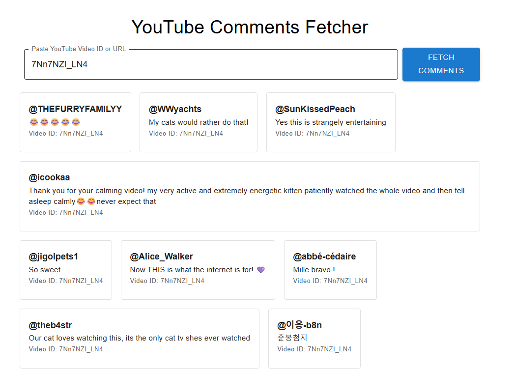
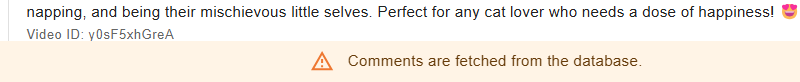

### YouTube Comments Fetcher

This project is a YouTube Comments Fetcher built with React and Material UI, designed to fetch comments from YouTube videos, check for recent comments, and save them to a backend database.

### Features

- Fetch comments from a YouTube video using the YouTube API.
- Display comments in a structured card layout using Material UI components.
- Fetch comments from the database if they have already been saved and are still recent.
- Post new comments to the backend database after fetching from YouTube.
- Error handling for invalid video IDs or issues while fetching comments.

### Tech Stack

- Frontend: React, Material UI, Axios
- Backend: Node.js, Express (for database interactions with MongoDB)
- Database: MongoDB (to store video comments)
- YouTube API: Used to fetch the comments for the specified video

### How to Run

- npm start

### Screenshots

- The following screenshots show the application in action in first fetching comments from a YouTube video and then displaying them in a card layout.

- The second time we try to fetch same video shows a warning banner that comments are fetched from dabtabase.
  
